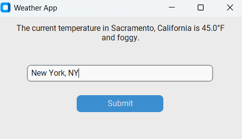

## Weather Application

This application serves mainly as a simple demo of using a LangChain tool with a LangChain agent.  Though the the use Langchain is a bit superflous here as far as 
the practical use of the Open-Meteo API, it works well for educational purposes as a simplified example.

This is a simple desktop weather assistant built with Python, `customtkinter`, `requests`, and a LangChain agent.  
You type a city (for example `Trenton, NJ`) into the window, and the app looks up the city’s coordinates via the Open‑Meteo geocoding API, fetches the current conditions, and then has an LLM agent respond with a friendly, human‑readable sentence such as:

> Trenton, NJ is currently 75.2°F and partly cloudy.

The response is displayed directly in the app window.

---

## Screenshot



---

## Features

- **LLM-powered weather assistant**: Uses a LangChain agent with a `get_current_weather` tool to call the Open‑Meteo API.
- **City name to coordinates**: Automatically geocodes the city name to latitude/longitude before fetching weather data.
- **Human‑friendly output**: Translates Open‑Meteo weather codes into readable descriptions (e.g., “light drizzle”, “clear skies”).
- **Simple GUI**: Desktop window built with `customtkinter` (a modern theming layer on top of Tkinter).

---

## Requirements

- **Python**: 3.9 or later (recommended)
- **Libraries** (from `requirements.txt`, install with `pip install -r requirements.txt`):
  - `langchain`
  - `requests`
  - `customtkinter`
  - Any additional packages required by your LangChain/LLM provider configuration

You also need network access so the Open‑Meteo APIs and LLM backend can be reached.

---

## How to Run

1. **Clone the repository** (or download the source):
   ```bash
   git clone https://github.com/mmastro333/Weather-Application.git
   cd Weather-Application
   ```

2. **Create and activate a virtual environment** (optional but recommended):
   ```bash
   python -m venv .venv
   # Windows (PowerShell)
   .venv\Scripts\Activate.ps1
   # macOS / Linux
   source .venv/bin/activate
   ```

3. **Install dependencies**:
   ```bash
   pip install -r requirements.txt
   ```

4. **Configure your LLM environment** (if needed):
   - Set any required API keys or environment variables used by your LangChain configuration (for example, `OPENAI_API_KEY`, `GEMINI_API_KEY`, etc.), depending on which model backend you actually use.

5. **Run the app**:
   ```bash
   python weather.py
   ```

6. **Use the app**:
   - A window titled **“Weather App”** will open.
   - In the text box, type a city (for example `Trenton, NJ`).
   - Click **Submit**.
   - The label updates to **“Fetching weather data ...”**, then the LLM agent’s final answer appears, e.g.:
     > Trenton, NJ is currently 75.2°F and partly cloudy.

---

## Operating System Compatibility

This GUI app is built on `customtkinter`, which runs on top of the standard Python Tkinter GUI toolkit. It is expected to work on:

- **Windows** 10/11 (tested)
- **macOS** (recent versions with a standard Python/Tk installation)
- **Linux** distributions that have Tkinter support installed

If Tkinter or `customtkinter` is not available on your platform’s Python distribution, install the appropriate Tk packages or use a Python build that includes Tk support.

---

## Project Structure

- `weather.py` – main application code (GUI + LangChain agent + weather tool).
- `requirements.txt` – Python dependencies.
- `README.md` – this documentation.
- `screenshot.png` – (optional) screenshot of the running app, referenced in the **Screenshot** section.

